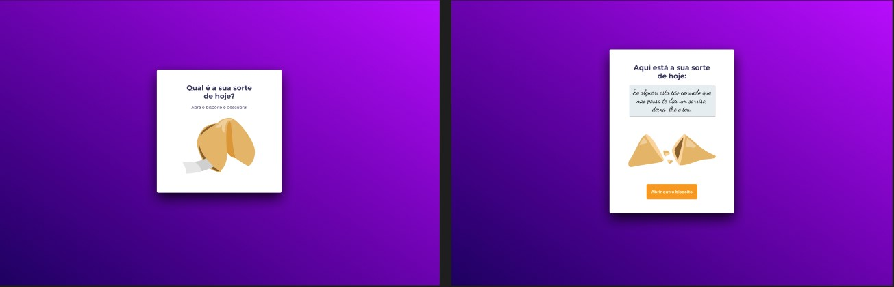

  

  

## 🖥️ Projeto
Neste projeto criamos um jogo chamado Biscoito da Sorte, no qual o usuário, **a partir de um clique ou enter**, abre um biscoito com a sua sorte do dia, onde aplicamos o que aprendemos sobre vários temas, entre eles:

- Estrutura de dados HTML
- Animações com CSS
- Funções no Javascript
- Manipulação da DOM
- Biblioteca JS Math()
- Funções *callback*
- Arrays

## 🚀 Tecnologias
Esse projeto foi desenvolvido durante o cursos de Explorer da Rocketsat com as seguintes tecnologias:

- HTML
- CSS
- JAVASCRIPT
- GIT E GITHUB
- FIGMA

## 🏷️layout
Você pode visualizar o layout do projeto através 
[desse link](https://www.figma.com/file/sWKWKsIWqj4pmhFwzZCIbw/Biscoito-da-Sorte-(Community)?node-id=0%3A1&mode=dev).
É necessario ter uma conta no [Figma](https://www.figma.com).